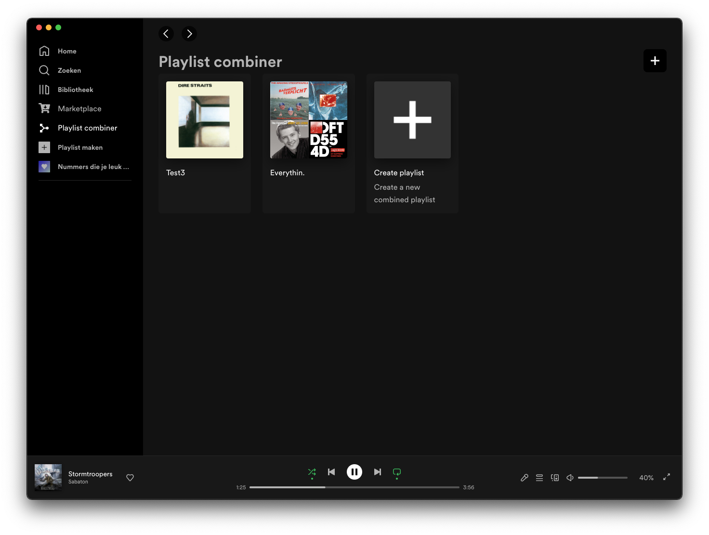
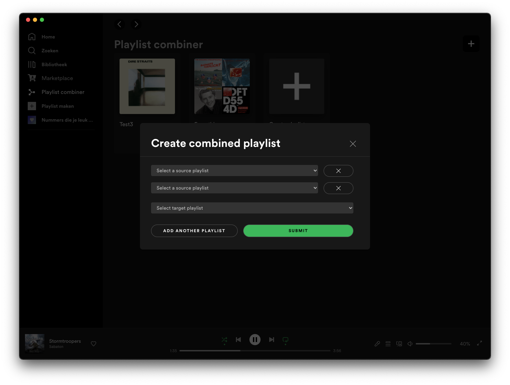
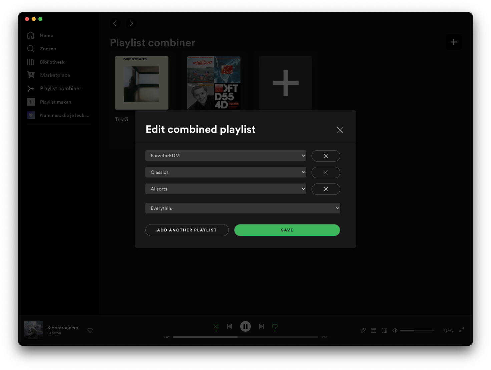

# Playlist combiner
Ever wanted to combine your spotify playlists into one big one? This Spicetify custom app is able to do just that.  
The app currently allows combining playlist into one playlists and synchronizing them with the press of a button after adding songs to one of the source playlists. The ultimate goal is to add the songs from the source to the target automatically. But that's still w.i.p.



<details>
<summary>Create and edit dialogs</summary>



</details>

## Installation
Copy the [combined-playlists](https://github.com/jeroentvb/spicetify-combined-playlists/tree/dist) folder from the [dist branch](https://github.com/jeroentvb/spicetify-combined-playlists/tree/dist) to the spicetify CustomApps folder located in:
| **Platform**    | **Path**                               |
|-----------------|----------------------------------------|
| **MacOs/Linux** | `~/.config/spicetify/CustomApps`       |
| **Windows**     | `%appdata%\spicetify\CustomApps\`      |

Then, run the following commands:
```sh
spicetify config custom_apps combined-playlists
spicetify apply
```

## Usage
Create a combined playlist using the `Create playlist` card, or using the `add` button in the top right corner. Only playlists you own, or have liked can be selected to create a combined playlist.

Combined playlists can be updated/synchronized by clicking the button on the card, or by opening the edit modal and pressing save.

Playlists may also be added or removed via the edit modal. Removing a playlist doesn't remove all songs from that playlist from the combined playlist. It only ensures new songs from that playlist won't be added to the combined playlist on future sync attempts.

```
⚠️ Combining a large amount of songs into a playlist may take some time
```

## Todo
See the [issues](https://github.com/jeroentvb/spicetify-combined-playlists/issues) tab.
